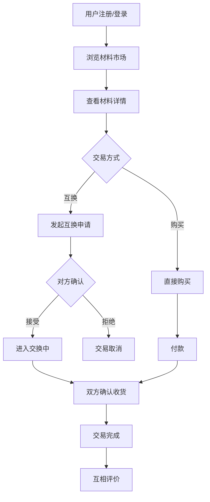
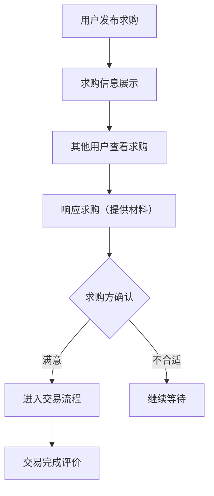
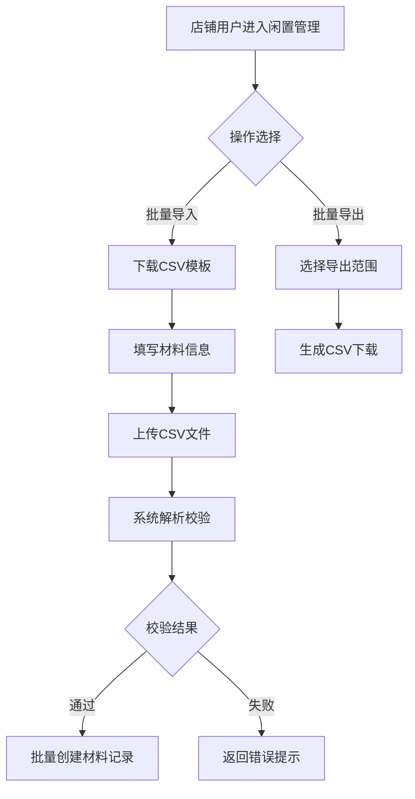

## 1. 产品概述

原木文艺风手工材料互换与闲置交易全栈平台，面向手工艺爱好者、手工材料收藏者及闲置材料持有者，提供一个兼具美感与实用性的材料流通生态。平台以"原木文艺风"为视觉基调，模拟麻绳与布料纹理，营造温暖质朴的手工氛围，让材料互换与闲置交易如同手作集市般自然亲切。

- 解决手工爱好者材料闲置浪费、互换信息不对称、交易信任缺失等问题
- 目标用户为手工艺人、DIY爱好者、手工材料店主、手工社群成员

## 2. 核心功能

### 2.1 用户角色

| 角色 | 注册方式 | 核心权限 |
|------|----------|----------|
| 普通用户 | 邮箱/用户名注册 | 浏览材料、发布闲置/求购、申请互换、评价交易、分享作品 |
| 店铺用户 | 普通用户升级 | 拥有个人闲置店铺、批量导入导出材料、数据统计 |

### 2.2 功能模块

1. **首页**：Hero横幅、材料分类导航、精选闲置推荐、最新求购、手工作品展示
2. **材料市场**：闲置材料列表、分类筛选、搜索排序、材料详情（实拍图+规格标注）
3. **材料求购**：求购信息列表、发布求购、求购详情
4. **互换交易**：互换申请、交易状态流转、交易消息通知
5. **个人店铺**：店铺主页、闲置管理、交易记录、信用评分
6. **手工作品**：作品分享列表、作品详情、评论交流
7. **消息中心**：实时消息通知、交易提醒、系统通知
8. **个人中心**：资料编辑、我的发布、我的交易、信用记录

### 2.3 页面详情

| 页面名称 | 模块名称 | 功能描述 |
|----------|----------|----------|
| 首页 | Hero横幅 | 原木文艺风大图轮播，展示平台理念标语 |
| 首页 | 分类导航 | 木质/布艺/皮具/编织/纸艺/颜料等材料分类快捷入口 |
| 首页 | 精选闲置推荐 | 最新/热门闲置材料卡片展示，含实拍缩略图、价格、标签 |
| 首页 | 最新求购 | 最近发布的求购信息摘要列表 |
| 首页 | 手工作品展示 | 社区精选手工作品瀑布流展示 |
| 材料市场 | 材料列表 | 分页、分类筛选、关键词搜索、排序（最新/价格/热门） |
| 材料市场 | 材料详情 | 实拍图画廊、规格标注（材质/尺寸/数量/品牌/新旧程度）、发布者信息、互换/购买操作 |
| 材料市场 | 发布闲置 | 表单：标题、分类、描述、实拍图上传（多图）、规格填写、定价/可互换标记 |
| 材料求购 | 求购列表 | 分页、分类筛选、求购状态（进行中/已找到/已关闭） |
| 材料求购 | 发布求购 | 表单：需求描述、材料类型、预算范围、期望规格 |
| 互换交易 | 互换申请 | 选择自己材料与对方材料进行互换申请，附留言 |
| 互换交易 | 交易状态 | 待确认→已接受→交换中→已完成/已取消，状态流转追踪 |
| 个人店铺 | 店铺主页 | 店铺头图、简介、闲置材料展示、信用评分、交易评价 |
| 个人店铺 | 闲置管理 | 批量导入/导出材料清单（CSV）、编辑/上下架 |
| 个人店铺 | 数据统计 | 材料浏览量、互换成功率、店铺访问趋势图 |
| 手工作品 | 作品列表 | 瀑布流展示、分类标签筛选 |
| 手工作品 | 作品详情 | 大图展示、制作过程描述、使用材料标签、评论交流 |
| 手工作品 | 发布作品 | 多图上传、标题、描述、关联材料标签 |
| 消息中心 | 消息列表 | 交易通知、互换申请、评价提醒、系统公告 |
| 个人中心 | 资料编辑 | 头像上传、昵称/简介修改 |
| 个人中心 | 我的发布 | 管理发布的闲置/求购/作品 |
| 个人中心 | 我的交易 | 交易记录列表、交易评价入口 |
| 个人中心 | 信用记录 | 信用评分、评价详情、历史交易信用变动 |
| 登录/注册 | 认证表单 | 用户名/邮箱注册、登录、JWT鉴权 |

## 3. 核心流程

### 3.1 闲置材料发布与互换流程

用户注册登录后，可发布闲置材料（上传实拍图、填写规格标注、标记是否可互换），其他用户浏览后可发起互换申请或直接购买。互换申请经对方确认后进入交易流程，双方确认收货后交易完成，可互相评价。

### 3.2 求购信息流程

### 3.3 批量导入导出流程

## 4. 用户界面设计

### 4.1 设计风格

- **主色调**：浅木色（#D4A574）、奶白色（#FFF8F0）、浅棕色（#8B6F47）
- **辅助色**：麻绳色（#C4A882）、抹茶绿（#A8B5A0）作为点缀
- **纹理**：麻绳编织纹理用于分隔线和边框装饰，布料纹理用于卡片背景和页面底纹
- **按钮风格**：圆润边角，浅木色主按钮带细微木纹阴影，次要按钮为描边风格
- **字体**：标题使用衬线体模拟手写刻字感，正文使用清晰圆体
- **布局**：卡片式布局为主，顶部导航，侧边分类，底部信息栏
- **图标**：线性图标搭配原木色描边，部分使用麻绳/木纹装饰图标

### 4.2 页面设计概述

| 页面名称 | 模块名称 | UI元素 |
|----------|----------|--------|
| 首页 | Hero横幅 | 全宽大图，麻绳纹理边框装饰，手写风格标语，淡入动画 |
| 首页 | 分类导航 | 圆角图标卡片，木色底色，hover时布料纹理浮现 |
| 首页 | 精选闲置 | 瀑布流卡片，实拍图+麻绳标签，hover浮起阴影 |
| 材料市场 | 材料列表 | 左侧分类侧栏+右侧网格卡片，木色筛选面板 |
| 材料市场 | 材料详情 | 大图画廊+规格标注表，麻绳分隔线，发布者卡片 |
| 材料市场 | 发布闲置 | 表单卡片，布料纹理背景，多图上传区域 |
| 个人店铺 | 店铺主页 | 头图横幅+材料网格，信用星标，统计图表 |
| 手工作品 | 作品列表 | 瀑布流大图，木色圆角卡片，标签云 |
| 消息中心 | 消息列表 | 左侧消息导航+右侧消息详情，木色侧栏 |
| 个人中心 | 资料编辑 | 卡片表单，头像圆形裁剪框 |

### 4.3 响应式设计

- 桌面优先设计，适配1280px+屏幕
- 平板端（768px-1280px）：侧栏收缩为抽屉，卡片网格从4列调为2列
- 移动端（<768px）：底部导航替代顶部导航，单列卡片，触摸优化按钮尺寸

### 4.4 动效设计

- 页面加载：卡片依次淡入上浮（stagger动画）
- 卡片hover：轻微上浮+阴影加深，木纹底纹隐现
- 按钮点击：下沉回弹微动效
- 交易状态变更：状态徽章脉冲闪烁提醒
- 消息到达：铃铛图标晃动
