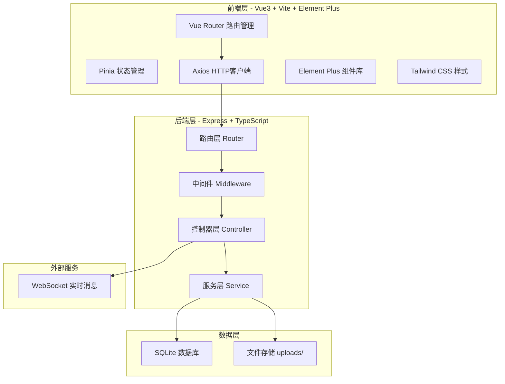
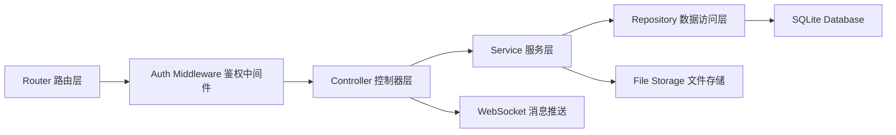
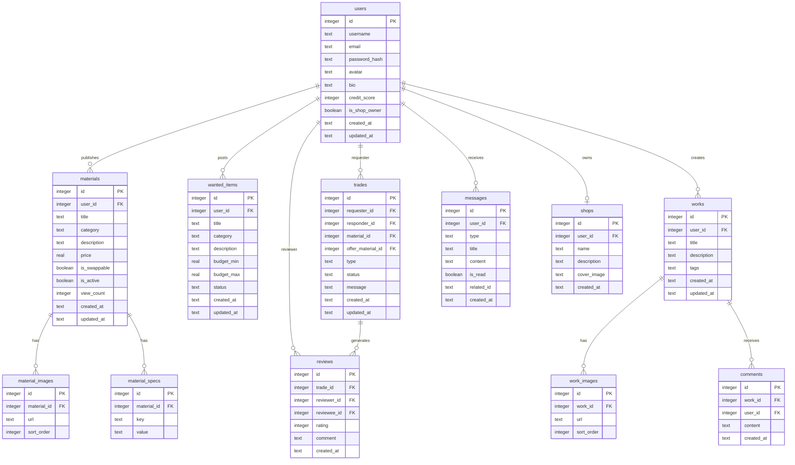

## 1. 架构设计



## 2. 技术说明

- **前端**：Vue3@3 + Vite@5 + Element Plus + Tailwind CSS + Vue Router + Pinia
- **初始化工具**：vite-init (vue-express-ts 模板)
- **后端**：Express@4 + TypeScript (ESM格式)
- **数据库**：SQLite3 (better-sqlite3)
- **鉴权**：JWT (jsonwebtoken + bcryptjs)
- **文件上传**：multer
- **实时消息**：ws (WebSocket)
- **数据导入导出**：csv-parse / csv-stringify

## 3. 路由定义

| 路由路径 | 用途 |
|----------|------|
| `/` | 首页 - Hero横幅、分类导航、精选推荐 |
| `/market` | 材料市场 - 闲置材料浏览与搜索 |
| `/market/:id` | 材料详情 - 实拍图、规格、互换操作 |
| `/market/publish` | 发布闲置材料 |
| `/wanted` | 求购信息列表 |
| `/wanted/publish` | 发布求购 |
| `/wanted/:id` | 求购详情 |
| `/shop/:id` | 个人店铺主页 |
| `/shop/manage` | 店铺管理（闲置管理、数据统计） |
| `/works` | 手工作品列表 |
| `/works/:id` | 作品详情 |
| `/works/publish` | 发布作品 |
| `/messages` | 消息中心 |
| `/profile` | 个人中心 |
| `/login` | 登录 |
| `/register` | 注册 |

## 4. API 定义

### 4.1 用户鉴权

```typescript
POST /api/auth/register
Request: { username: string; email: string; password: string }
Response: { token: string; user: User }

POST /api/auth/login
Request: { email: string; password: string }
Response: { token: string; user: User }

GET /api/auth/me
Headers: { Authorization: "Bearer <token>" }
Response: { user: User }
```

### 4.2 材料管理

```typescript
GET /api/materials?page=1&limit=20&category=wood&keyword=&sort=latest
Response: { list: Material[]; total: number; page: number }

GET /api/materials/:id
Response: Material & { publisher: User; images: Image[] }

POST /api/materials
Headers: { Authorization: "Bearer <token>" }
Request: { title: string; category: string; description: string; specs: Spec[]; price: number; isSwappable: boolean; images: string[] }
Response: Material

PUT /api/materials/:id
Headers: { Authorization: "Bearer <token>" }
Request: Partial<Material>
Response: Material

DELETE /api/materials/:id
Headers: { Authorization: "Bearer <token>" }
Response: { success: boolean }

POST /api/materials/batch-import
Headers: { Authorization: "Bearer <token>" }
Request: FormData { file: File }
Response: { imported: number; failed: number; errors: string[] }

GET /api/materials/batch-export?ids=1,2,3
Headers: { Authorization: "Bearer <token>" }
Response: CSV file stream

POST /api/upload
Headers: { Authorization: "Bearer <token>" }
Request: FormData { files: File[] }
Response: { urls: string[] }
```

### 4.3 互换交易

```typescript
POST /api/trades
Headers: { Authorization: "Bearer <token>" }
Request: { materialId: string; offerMaterialId?: string; type: "swap" | "buy"; message: string }
Response: Trade

GET /api/trades?page=1&status=pending
Headers: { Authorization: "Bearer <token>" }
Response: { list: Trade[]; total: number }

PUT /api/trades/:id/status
Headers: { Authorization: "Bearer <token>" }
Request: { status: "accepted" | "rejected" | "shipping" | "completed" | "cancelled" }
Response: Trade

POST /api/trades/:id/review
Headers: { Authorization: "Bearer <token>" }
Request: { rating: number; comment: string }
Response: Review
```

### 4.4 求购信息

```typescript
GET /api/wanted?page=1&category=&status=open
Response: { list: WantedItem[]; total: number }

POST /api/wanted
Headers: { Authorization: "Bearer <token>" }
Request: { title: string; category: string; description: string; budget: { min: number; max: number }; specs: string }
Response: WantedItem

PUT /api/wanted/:id
Headers: { Authorization: "Bearer <token>" }
Request: Partial<WantedItem>
Response: WantedItem

PUT /api/wanted/:id/status
Headers: { Authorization: "Bearer <token>" }
Request: { status: "found" | "closed" }
Response: WantedItem
```

### 4.5 手工作品

```typescript
GET /api/works?page=1&tag=
Response: { list: Work[]; total: number }

GET /api/works/:id
Response: Work & { author: User; comments: Comment[] }

POST /api/works
Headers: { Authorization: "Bearer <token>" }
Request: { title: string; description: string; images: string[]; tags: string[]; relatedMaterialIds: string[] }
Response: Work

POST /api/works/:id/comments
Headers: { Authorization: "Bearer <token>" }
Request: { content: string }
Response: Comment
```

### 4.6 店铺与统计

```typescript
GET /api/shops/:id
Response: { shop: Shop; materials: Material[]; stats: ShopStats }

GET /api/shops/my/stats
Headers: { Authorization: "Bearer <token>" }
Response: { views: number; swapRate: number; trend: TrendData[] }
```

### 4.7 消息通知

```typescript
GET /api/messages?page=1
Headers: { Authorization: "Bearer <token>" }
Response: { list: Message[]; total: number; unread: number }

PUT /api/messages/:id/read
Headers: { Authorization: "Bearer <token>" }
Response: { success: boolean }

WebSocket ws://host/ws?token=<jwt>
Events: { type: "trade_update" | "new_message" | "system"; data: any }
```

### 4.8 信用评价

```typescript
GET /api/users/:id/credit
Response: { score: number; reviews: Review[]; tradeCount: number }

GET /api/users/:id/reviews
Response: { list: Review[]; averageRating: number }
```

## 5. 服务器架构图



## 6. 数据模型

### 6.1 数据模型定义



### 6.2 数据定义语言

```sql
CREATE TABLE users (
    id INTEGER PRIMARY KEY AUTOINCREMENT,
    username TEXT NOT NULL UNIQUE,
    email TEXT NOT NULL UNIQUE,
    password_hash TEXT NOT NULL,
    avatar TEXT DEFAULT '',
    bio TEXT DEFAULT '',
    credit_score INTEGER DEFAULT 100,
    is_shop_owner BOOLEAN DEFAULT 0,
    created_at TEXT DEFAULT (datetime('now')),
    updated_at TEXT DEFAULT (datetime('now'))
);

CREATE TABLE materials (
    id INTEGER PRIMARY KEY AUTOINCREMENT,
    user_id INTEGER NOT NULL REFERENCES users(id),
    title TEXT NOT NULL,
    category TEXT NOT NULL,
    description TEXT DEFAULT '',
    price REAL DEFAULT 0,
    is_swappable BOOLEAN DEFAULT 1,
    is_active BOOLEAN DEFAULT 1,
    view_count INTEGER DEFAULT 0,
    created_at TEXT DEFAULT (datetime('now')),
    updated_at TEXT DEFAULT (datetime('now'))
);

CREATE TABLE material_images (
    id INTEGER PRIMARY KEY AUTOINCREMENT,
    material_id INTEGER NOT NULL REFERENCES materials(id) ON DELETE CASCADE,
    url TEXT NOT NULL,
    sort_order INTEGER DEFAULT 0
);

CREATE TABLE material_specs (
    id INTEGER PRIMARY KEY AUTOINCREMENT,
    material_id INTEGER NOT NULL REFERENCES materials(id) ON DELETE CASCADE,
    key TEXT NOT NULL,
    value TEXT NOT NULL
);

CREATE TABLE wanted_items (
    id INTEGER PRIMARY KEY AUTOINCREMENT,
    user_id INTEGER NOT NULL REFERENCES users(id),
    title TEXT NOT NULL,
    category TEXT NOT NULL,
    description TEXT DEFAULT '',
    budget_min REAL DEFAULT 0,
    budget_max REAL DEFAULT 0,
    status TEXT DEFAULT 'open',
    created_at TEXT DEFAULT (datetime('now')),
    updated_at TEXT DEFAULT (datetime('now'))
);

CREATE TABLE trades (
    id INTEGER PRIMARY KEY AUTOINCREMENT,
    requester_id INTEGER NOT NULL REFERENCES users(id),
    responder_id INTEGER NOT NULL REFERENCES users(id),
    material_id INTEGER NOT NULL REFERENCES materials(id),
    offer_material_id INTEGER REFERENCES materials(id),
    type TEXT NOT NULL DEFAULT 'swap',
    status TEXT DEFAULT 'pending',
    message TEXT DEFAULT '',
    created_at TEXT DEFAULT (datetime('now')),
    updated_at TEXT DEFAULT (datetime('now'))
);

CREATE TABLE reviews (
    id INTEGER PRIMARY KEY AUTOINCREMENT,
    trade_id INTEGER NOT NULL REFERENCES trades(id),
    reviewer_id INTEGER NOT NULL REFERENCES users(id),
    reviewee_id INTEGER NOT NULL REFERENCES users(id),
    rating INTEGER NOT NULL CHECK(rating >= 1 AND rating <= 5),
    comment TEXT DEFAULT '',
    created_at TEXT DEFAULT (datetime('now'))
);

CREATE TABLE works (
    id INTEGER PRIMARY KEY AUTOINCREMENT,
    user_id INTEGER NOT NULL REFERENCES users(id),
    title TEXT NOT NULL,
    description TEXT DEFAULT '',
    tags TEXT DEFAULT '',
    created_at TEXT DEFAULT (datetime('now')),
    updated_at TEXT DEFAULT (datetime('now'))
);

CREATE TABLE work_images (
    id INTEGER PRIMARY KEY AUTOINCREMENT,
    work_id INTEGER NOT NULL REFERENCES works(id) ON DELETE CASCADE,
    url TEXT NOT NULL,
    sort_order INTEGER DEFAULT 0
);

CREATE TABLE comments (
    id INTEGER PRIMARY KEY AUTOINCREMENT,
    work_id INTEGER NOT NULL REFERENCES works(id) ON DELETE CASCADE,
    user_id INTEGER NOT NULL REFERENCES users(id),
    content TEXT NOT NULL,
    created_at TEXT DEFAULT (datetime('now'))
);

CREATE TABLE messages (
    id INTEGER PRIMARY KEY AUTOINCREMENT,
    user_id INTEGER NOT NULL REFERENCES users(id),
    type TEXT NOT NULL,
    title TEXT NOT NULL,
    content TEXT DEFAULT '',
    is_read BOOLEAN DEFAULT 0,
    related_id TEXT DEFAULT '',
    created_at TEXT DEFAULT (datetime('now'))
);

CREATE TABLE shops (
    id INTEGER PRIMARY KEY AUTOINCREMENT,
    user_id INTEGER NOT NULL REFERENCES users(id) UNIQUE,
    name TEXT NOT NULL,
    description TEXT DEFAULT '',
    cover_image TEXT DEFAULT '',
    created_at TEXT DEFAULT (datetime('now'))
);

CREATE INDEX idx_materials_user ON materials(user_id);
CREATE INDEX idx_materials_category ON materials(category);
CREATE INDEX idx_materials_active ON materials(is_active);
CREATE INDEX idx_wanted_user ON wanted_items(user_id);
CREATE INDEX idx_wanted_status ON wanted_items(status);
CREATE INDEX idx_trades_requester ON trades(requester_id);
CREATE INDEX idx_trades_responder ON trades(responder_id);
CREATE INDEX idx_trades_status ON trades(status);
CREATE INDEX idx_reviews_reviewee ON reviews(reviewee_id);
CREATE INDEX idx_works_user ON works(user_id);
CREATE INDEX idx_comments_work ON comments(work_id);
CREATE INDEX idx_messages_user ON messages(user_id);
CREATE INDEX idx_messages_read ON messages(is_read);
```
